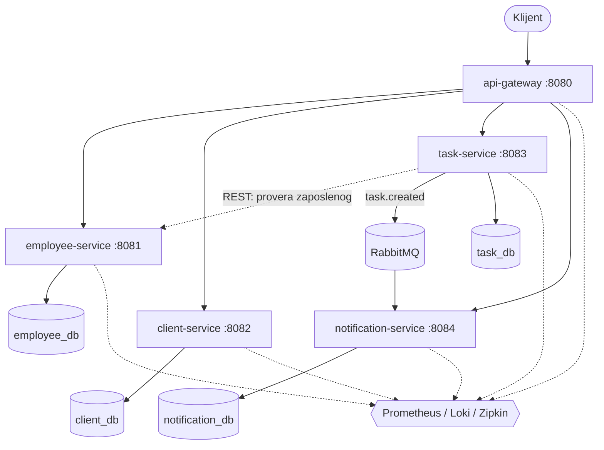

# Projektna dokumentacija — CRM/HRM mikroservisni sistem

**Repozitorijum:** https://github.com/LukaC011/devOps

---

## Sadržaj

1. Opis sistema i arhitektura
2. Tehnologije i obrazloženje izbora
3. Ispunjenost zahteva po tačkama specifikacije
4. Tabela: zahtev do implementacije
5. Git workflow i istorija pull request-ova
6. Uputstvo za lokalni deploy
7. Dokazi o radu sistema

---

## 1. Opis sistema i arhitektura

Sistem je CRM/HRM aplikacija podeljena na pet mikroservisa. Poslovni domen obuhvata
zaposlene, klijente, zadatke koji se dodeljuju zaposlenima i notifikacije koje nastaju
kao posledica kreiranja zadatka.



### Ključne arhitektonske odluke

**Gateway kao jedina ulazna tačka.** Svi poslovni pozivi idu kroz `api-gateway` na portu
8080, sa prefiksom `/api`. Gateway rutira po `Path` predikatu i skida prefiks `StripPrefix`
filterom, tako da servisi iza njega vide svoje originalne putanje.

**Baza po servisu.** Umesto jedne deljene šeme, svaki servis ima svoju bazu
(`employee_db`, `client_db`, `task_db`, `notification_db`) unutar iste PostgreSQL instance.
Baze se kreiraju automatski, init skriptom montiranom u `/docker-entrypoint-initdb.d/`.
Nijedan servis ne čita tuđe tabele — komunikacija ide isključivo kroz REST ili poruke.

**Konfiguracija kroz environment promenljive.** Nijedan port, URL servisa, kredencijal baze
ili adresa brokera nije hardkodovan. Sve dolazi iz `.env` fajla kroz Docker Compose, sa
razumnim podrazumevanim vrednostima za pokretanje van kontejnera.

### Tok jednog zahteva

Kreiranje zadatka je scenario koji dodiruje sve tipove komunikacije:

1. Klijent šalje `POST /api/tasks` gateway-u.
2. Gateway rutira zahtev na `task-service`.
3. `task-service` sinhrono, preko REST-a, pita `employee-service` da li zaposleni postoji.
   Ako ne postoji, lanac se prekida sa `404`.
4. `task-service` upisuje zadatak u svoju bazu.
5. `task-service` objavljuje `task.created` događaj na RabbitMQ topic exchange.
6. `notification-service` asinhrono konzumira događaj, upisuje notifikaciju u svoju bazu
   i loguje je.

Ceo lanac je vidljiv kao jedan trace u Zipkin-u, uključujući i skok kroz broker.

---

## 2. Tehnologije i obrazloženje izbora

| Oblast | Izbor | Zašto |
|---|---|---|
| Jezik i framework | Java 17, Spring Boot 4.0.5 | Aktuator daje health, metrike i Prometheus endpoint bez pisanja koda |
| API Gateway | Spring Cloud Gateway (WebMVC) | Deklarativno rutiranje kroz konfiguraciju, bez pisanja rutera |
| Baza | PostgreSQL 15 sa Spring Data JPA | JPA uklanja SQL boilerplate za CRUD |
| Broker | RabbitMQ | Topic exchange omogućava dodavanje konzumera bez izmene producera |
| Reaktivnost | Spring WebFlux (Reactor) i RxJava 3 | Specifikacija navodi RxJava imenom, pa je uz `Flux` dodat i `Flowable` endpoint |
| Metrike | Prometheus i Grafana | Micrometer izlaže metrike u Prometheus formatu bez dodatnog koda |
| Logovi | Loki, preko loki4j appender-a | Servisi guraju logove direktno, nema Promtail sidecar-a za održavanje |
| Trace-ovi | Zipkin, preko Micrometer Tracing (Brave) | Sopstveni UI koji jasno prikazuje lanac poziva |
| CI/CD | GitHub Actions | Isti provajder kao repozitorijum, bez dodatne integracije |
| Statička analiza | SonarCloud sa JaCoCo | Besplatan za javne repozitorijume, sa quality gate mehanizmom |
| Testiranje | JUnit 5, Mockito, RestAssured, Awaitility | Awaitility je neophodan jer je notifikacija asinhrona |

**gRPC nije implementiran.** Specifikacija ga eksplicitno označava kao opcioni, u
kombinaciji sa REST-om. Sva četiri obavezna tipa komunikacije su pokrivena.

---

## 3. Ispunjenost zahteva po tačkama specifikacije

### Tačka 1 — Opšti zahtevi početne aplikacije

**Pet mikroservisa**, uz zahtevani minimum od četiri: `api-gateway`, `employee-service`,
`client-service`, `task-service`, `notification-service`.

**Svaki servis ima endpointe.** `employee-service` i `task-service` imaju pun CRUD,
`client-service` ima listanje, dohvatanje i kreiranje plus dva reaktivna stream endpointa,
`notification-service` izlaže listu notifikacija. Kompletna tabela endpointa je u `README.md`.

**API Gateway** rutira četiri grupe putanja i jedina je ulazna tačka sistema.

**Logovi, metrike i trace-ovi** se šalju iz svih pet servisa: metrike na Prometheus preko
`/actuator/prometheus` uz svih pet aktivnih target-a, logovi u Loki sa `traceId` i `spanId`
u svakom zapisu, trace-ovi u Zipkin sa uzorkovanjem od sto posto.

**Tipovi komunikacije**, sva četiri obavezna:

| Tip | Implementacija |
|---|---|
| REST, sinhrono | Gateway rutira ka svim servisima |
| REST, servis ka servisu | `task-service` proverava zaposlenog kod `employee-service` preko `RestClient`-a |
| Message Queue | `task-service` objavljuje `task.created`, `notification-service` konzumira preko `@RabbitListener` |
| Reaktivno | `client-service` na WebFlux-u; `/clients/stream` vraća `Flux`, `/clients/flowable` vraća RxJava `Flowable`, oba kao Server-Sent Events |

### Tačka 2 — Git workflow i verzionisanje

Rad je išao isključivo kroz feature grane, uz obavezan pull request za svaku celinu.
Direktnog push-a na `main` nije bilo nijednom. Ukupno 23 pull request-a, imenovana po
konvenciji `feature/*`, `fix/*`, `chore/*` i `docs/*`. Commit poruke prate Conventional
Commits format. Puna istorija je u sekciji 5.

### Tačka 3 — Testiranje

Testovi su pisani paralelno sa razvojem, u istom pull request-u kao i kod koji pokrivaju.

| Nivo | Broj | Alat |
|---|---|---|
| Jedinični i integracioni | 60 | JUnit 5, Mockito, Spring Boot test slice-ovi |
| End-to-end | 13 | RestAssured, Awaitility |

Jedinični testovi koriste ugrađenu H2 bazu, pa CI ne mora da diže PostgreSQL. End-to-end
testovi rade nad stvarno podignutim sistemom, kroz gateway, i pokrivaju health svih pet
servisa, rutiranje kroz gateway za sve putanje uključujući reaktivne stream-ove, ceo lanac
od kreiranja zadatka do pojave notifikacije, i odbijanje zadatka za nepostojećeg zaposlenog.

Pokrivenost koda je 95,7 posto, odnosno sto posto ako se izuzmu `main` metode koje se ne
mogu testirati. Svi testovi prolaze.

### Tačka 4 — CI pipeline

CI se pokreće automatski na svaki push i svaki pull request. Obuhvata build svih pet
servisa kroz jedan aggregator POM, izvršavanje svih testova, SonarCloud analizu sa JaCoCo
izveštajem o pokrivenosti, upload build artefakata gde se svi `.jar` fajlovi čuvaju uz run,
Docker build svih pet image-a paralelno kroz matrix strategiju, i end-to-end testove nad
podignutim sistemom.

### Tačka 5 — Docker kontejnerizacija

Svih pet servisa je kontejnerizovano, svaki sa sopstvenim `Dockerfile`-om.

Build je **multi-stage**: build faza koristi Maven image, runtime faza samo JRE, pa finalni
image ne sadrži Maven ni izvorni kod. **`.dockerignore`** postoji u svakom od pet servisa i
isključuje `target/`, `.git/`, Maven wrapper i markdown fajlove iz build konteksta.
**Environment promenljive** pokrivaju port, URL-ove servisa, kredencijale baze i brokera,
adrese Zipkin-a i Loki-ja. **Tagovanje** ide sa `latest` i sa SHA commit-a. **Docker build
je integrisan u CI** i pokreće se automatski na svaki push.

Image-i se objavljuju na GitHub Container Registry, iako specifikacija to označava kao
opcioni korak za lokalno kontejnerizovanu aplikaciju.

### Tačka 6 — Docker Compose orkestracija

Ceo sistem se podiže jednom komandom. `docker-compose.yml` sadrži jedanaest kontejnera:
pet servisa, PostgreSQL, RabbitMQ, Prometheus, Grafana, Loki i Zipkin.

**Mreža**: svi kontejneri su na zajedničkoj `crm_network` bridge mreži i međusobno se
adresiraju po imenu servisa. **Environment varijable** su izdvojene u `.env`, koji nije u
verzionisanju, dok je `.env.example` commit-ovan kao šablon. **Healthcheck mehanizmi**:
svaki servis proverava svoj `/actuator/health`, PostgreSQL koristi `pg_isready`, RabbitMQ
`rabbitmq-diagnostics ping`, Prometheus i Grafana svoje health endpointe; `depends_on`
svuda koristi `condition: service_healthy`, pa `docker compose up --wait` pada umesto da
vrati polupodignut sistem. **Volume-i za perzistenciju**: `pgdata` za bazu, `grafana-data`
i `prometheus-data` za monitoring konfiguraciju i istoriju metrika.

### Tačka 7 — Statička analiza koda

SonarCloud je integrisan u CI pipeline i pokreće se nad svih pet modula kroz jedan scan nad
aggregator POM-om. JaCoCo generiše izveštaj o pokrivenosti koji se prosleđuje Sonar-u.

Analiza pokriva code smells, potencijalne bugove i sigurnosne probleme. Quality gate obara
build ako nije zadovoljen, jer je `sonar.qualitygate.wait=true` uključen. Taj flag je
namerno uključen tek kada je kod bio čist, da ne bi blokirao rad tokom razvoja. Trenutno
stanje: quality gate prolazi.

Analiza se pokreće na pull request-ovima i na `main` grani. Nije uključena na push
proizvoljne feature grane, jer SonarCloud za taj slučaj ne autorizuje čitanje statusa
quality gate-a.

### Tačka 8 — Deployment

Deploy je realizovan u potpunosti lokalno, u kontejnerizovanom okruženju, što specifikacija
izričito dozvoljava.

Skripta `deploy.sh` podiže Docker aplikaciju sa bazom, čeka da svaki kontejner prijavi
`healthy`, zatim proverava health endpoint svakog od pet servisa i rutiranje kroz gateway.
Provere imaju retry mehanizam, jer mapiranje portova ume da zakasni sekundu-dve za
kontejnerom. Skripta vraća neuspeh ako bilo koja provera ne prođe. Konfiguracija
environment varijabli se čita iz `.env`, koji skripta kreira iz `.env.example` ako ne
postoji.

### Tačka 9 — CD pipeline

CD je poseban workflow koji se pokreće automatski kada se pull request merge-uje u `main`.

Obuhvata dva posla. Prvi builda i objavljuje svih pet image-a na GitHub Container Registry,
paralelno, tagovane sa `latest` i sa SHA commit-a.

Drugi je post-deploy provera: povlači upravo objavljene image-e po SHA tagu, podiže ceo
sistem u runner-u i proverava da svih pet servisa vraća `200` na health endpointu, zatim
kroz gateway kreira zaposlenog i zadatak, proverava da zadatak za nepostojećeg zaposlenog
vraća `404`, i čeka da se notifikacija pojavi iz reda poruka. Job pada ako bilo šta od toga
ne prođe, a pri padu ispisuje logove kontejnera.

### Tačka 10 — Monitoring i observability

Monitoring je potpuno lokalni, zasnovan na kombinaciji Prometheus i Grafana, uz Loki za
logove i Zipkin za trace-ove.

Grafana se diže sa automatski provizioniranim datasource-ima i dashboardom, pa se ništa ne
podešava ručno i konfiguracija preživljava `docker compose down`.

Dashboard `CRM System Overview` prati sve tri tražene metrike, po servisu:

| Panel | Upit |
|---|---|
| `Latency (p95)` | `histogram_quantile(0.95, sum(rate(http_server_requests_seconds_bucket[1m])) by (le, application))` |
| `Throughput (req/s)` | `sum(rate(http_server_requests_seconds_count[1m])) by (application)` |
| `Error rate` | udeo `5xx` odgovora u ukupnom saobraćaju, sa vraćanjem na nulu kada grešaka nema |

Da bi `Latency` panel imao podatke, u svim servisima su uključeni histogram bucket-i kroz
`management.metrics.distribution.percentiles-histogram.http.server.requests=true`. Bez toga
Micrometer objavljuje samo zbir i broj zahteva, pa upit nad `_bucket` serijom ne bi vraćao
ništa.

Pored metrika, sistem daje centralizovane logove u Loki-ju, sa `traceId` i `spanId` kao
izdvojenim labelama, pa se svi logovi jednog zahteva mogu izdvojiti kroz sve servise, i
distribuirane trace-ove u Zipkin-u, gde jedan `POST /api/tasks` daje trace od sedam spanova
kroz četiri servisa, uključujući i asinhroni skok kroz RabbitMQ.

---

## 4. Tabela: zahtev do implementacije

| Zahtev | Gde je implementiran | Grana i PR |
|---|---|---|
| Minimalno 4 mikroservisa | `backend/` | `feature/setup-microservices`, PR #2 |
| Endpoint u svakom servisu | `backend/*/src/main/java/**/*Controller.java` | `feature/service-endpoints`, PR #10 |
| API Gateway sa rutama | `backend/api-gateway/src/main/resources/application.yml` | `feature/api-gateway-routing`, PR #11 |
| Baza po servisu, JPA sloj | `initdb/01-create-databases.sql`, `backend/*/…/*Repository.java` | `feature/database-layer`, PR #14 |
| REST komunikacija servis ka servisu | `backend/task-service/…/EmployeeClient.java` | `feature/rest-communication`, PR #15 |
| Message Queue | `backend/task-service/…/TaskEventPublisher.java`, `backend/notification-service/…/TaskCreatedListener.java` | `feature/messaging-rabbitmq`, PR #16 |
| Reaktivna komunikacija | `backend/client-service/…/ReactiveClientService.java` | `feature/reactive-client-service`, PR #17 |
| Trace-ovi | `management.tracing.*` u svih pet servisa, `zipkin` u compose-u | `feature/observability-tracing`, PR #18 |
| Centralizovani logovi | `backend/*/src/main/resources/logback-spring.xml`, `loki` u compose-u | `feature/observability-logs`, PR #19 |
| Metrike i dashboard | `prometheus.yml`, `grafana/dashboards/crm-overview.json` | `feature/grafana-dashboards`, PR #20 |
| Unit testovi | `backend/*/src/test/java/**` | uz svaki PR sa kodom |
| End-to-end testovi | `e2e-tests/src/test/java/**` | `feature/e2e-tests`, PR #23 |
| CI pipeline | `.github/workflows/ci.yml` | `feature/ci-all-services`, PR #13 |
| Build artefakti | korak `Upload build artefakata` u `ci.yml` | `feature/ci-all-services`, PR #13 |
| Dockerfile i multi-stage | `backend/*/Dockerfile` | `feature/setup-microservices`, PR #2 |
| `.dockerignore` | `backend/*/.dockerignore` | `chore/repo-hygiene`, PR #9 |
| Environment promenljive | `.env.example`, `docker-compose.yml` | `feature/compose-full-stack`, PR #12 |
| Tagovanje image-a | `.github/workflows/cd.yml` | `feature/cd-all-services`, PR #22 |
| Docker Compose, mreža, volume-i | `docker-compose.yml` | `feature/compose-full-stack`, PR #12 |
| Healthcheck mehanizmi | `docker-compose.yml`, `curl` u runtime fazi Dockerfile-a | `chore/repo-hygiene` PR #9, `feature/compose-full-stack` PR #12 |
| Statička analiza | korak `SonarCloud Scan` u `ci.yml`, JaCoCo u `backend/*/pom.xml` | `feature/database-layer` PR #14, `feature/sonar-quality-gate` PR #21 |
| Deployment sa health proverom | `deploy.sh` | `feature/cd-all-services`, PR #22 |
| CD pipeline | `.github/workflows/cd.yml` | `feature/cd-pipeline` PR #5, `feature/cd-all-services` PR #22 |
| Post-deploy provera | job `post-deploy-check` u `cd.yml` | `feature/cd-all-services`, PR #22 |
| Latency, throughput, error rate | `grafana/dashboards/crm-overview.json` | `feature/grafana-dashboards`, PR #20 |

---

## 5. Git workflow i istorija pull request-ova

Svaka celina je razvijana na zasebnoj grani i uvedena u `main` isključivo kroz pull request.
`main` u svakom trenutku sadrži stabilan kod, sa zelenim CI-jem.

| PR | Grana | Naslov |
|---|---|---|
| #1 | `feature/init-project-structure` | Added base project structure and .gitignore |
| #2 | `feature/setup-microservices` | feat: Initialized Spring Boot services, added DockerFile and docker-compose |
| #3 | `feature/testing-and-ci` | feat: Added JUnit test and GitHub actions CI pipeline |
| #4 | `feature/static-analysis` | feat: SonarCloud integration |
| #5 | `feature/cd-pipeline` | feat: Added CD pipeline for GitHub packages and a local deploy script |
| #6 | `feature/monitoring` | feat: Prometheus and Grafana monitoring implementation |
| #7 | `fix/grafana-config` | fix: Prometheus and Grafana variable configuration |
| #8 | `chore/repo-hygiene` | chore: normalize line endings |
| #9 | `chore/repo-hygiene` | chore: Docker file naming and line ending hygiene |
| #10 | `feature/service-endpoints` | feat: add REST endpoints and actuator metrics to every service |
| #11 | `feature/api-gateway-routing` | feat: route /api traffic through the gateway to each service |
| #12 | `feature/compose-full-stack` | feat: run the whole system from Docker Compose |
| #13 | `feature/ci-all-services` | ci: build, test and package every service |
| #14 | `feature/database-layer` | feat: add JPA persistence layer to all four business services |
| #15 | `feature/rest-communication` | feat: validate employee over REST before creating a task |
| #16 | `feature/messaging-rabbitmq` | feat: publish task.created events to notification service |
| #17 | `feature/reactive-client-service` | feat: serve clients reactively with Reactor and RxJava streams |
| #18 | `feature/observability-tracing` | feat: trace requests across all services with Zipkin |
| #19 | `feature/observability-logs` | feat: ship service logs to Loki with trace correlation |
| #20 | `feature/grafana-dashboards` | feat: add Grafana dashboard for latency, throughput and errors |
| #21 | `feature/sonar-quality-gate` | ci: fail the build when the Sonar quality gate fails |
| #22 | `feature/cd-all-services` | feat: publish all five images and verify the deployment |
| #23 | `feature/e2e-tests` | test: add end to end tests against the running stack |

Izvoz istorije u bilo kom trenutku:

```bash
gh pr list --state all --limit 100
```

---

## 6. Uputstvo za lokalni deploy

Jedini preduslov je Docker sa Compose dodatkom.

```bash
git clone https://github.com/LukaC011/devOps.git
cd devOps
cp .env.example .env
./deploy.sh
```

Skripta builda sve image-e, podiže jedanaest kontejnera, čeka da svaki prijavi `healthy`,
proverava health endpoint svih pet servisa i rutiranje kroz gateway, pa ispisuje adrese
alata. Prvo pokretanje traje nekoliko minuta jer se svi image-i grade lokalno.

Provera da sistem stvarno radi:

```bash
curl -X POST http://localhost:8080/api/employees \
  -H 'Content-Type: application/json' \
  -d '{"firstName":"Mila","lastName":"Jovanovic","position":"HR Manager","email":"mila@crm.rs"}'

curl -X POST http://localhost:8080/api/tasks \
  -H 'Content-Type: application/json' \
  -d '{"title":"Pripremi ponudu","description":"Ponuda za klijenta","employeeId":1}'

curl http://localhost:8080/api/notifications
```

Poslednji poziv vraća notifikaciju koja je nastala automatski, preko RabbitMQ-a.

Adrese alata:

| Alat | Adresa |
|---|---|
| Gateway | http://localhost:8080/api |
| Grafana | http://localhost:3000 |
| Prometheus | http://localhost:9090 |
| Zipkin | http://localhost:9411 |
| RabbitMQ | http://localhost:15672 |

Gašenje sistema, uz brisanje podataka:

```bash
docker compose down -v
```

---

## 7. Dokazi o radu sistema

### Trace kroz četiri servisa

Jedan `POST /api/tasks` daje u Zipkin-u trace od sedam spanova:

```
api-gateway           http post /api/tasks/**          SERVER
api-gateway           http post                        CLIENT
task-service          http post /tasks                 SERVER
task-service          http get                         CLIENT
employee-service      http get /employees/{id}         SERVER
task-service          crm.exchange/task.created send   PRODUCER
notification-service  task.created.queue receive       CONSUMER
```

### Korelacija logova po trace ID-u

U Grafani, nad Loki datasource-om, svi logovi jednog zahteva se izdvajaju upitom oblika
`{application="task-service"} | traceId=<vrednost>`. Isti trace ID postoji i u logovima
`notification-service`-a, iako je do njega poruka stigla asinhrono kroz broker.

### Post-deploy provera u CD-u

Iz izlaza `post-deploy-check` job-a, nad image-ima povučenim po SHA tagu:

```
api-gateway          -> 200
employee-service     -> 200
client-service       -> 200
task-service         -> 200
notification-service -> 200

POST /api/tasks                              -> 201
POST /api/tasks sa nepostojecim zaposlenim   -> 404
notifikacija stigla iz reda: [{"message":"Kreiran je zadatak: Smoke task","taskId":1}]
```

### Screenshotovi za odbranu

Uz dokumentaciju se prilažu snimci ekrana:

| Snimak | Odakle |
|---|---|
| Zelen CI pipeline | GitHub, kartica Actions, CI Pipeline nad `main` |
| Zelen CD pipeline sa post-deploy proverom | GitHub, kartica Actions, CD Pipeline nad `main` |
| SonarCloud rezultat sa pokrivenošću | SonarCloud, projekat `LukaC011_devOps` |
| Grafana dashboard sa tri metrike | http://localhost:3000, dashboard `CRM System Overview` |
| Zipkin trace kroz četiri servisa | http://localhost:9411, pretraga po servisu `task-service` |
| Loki logovi filtrirani po trace ID-u | http://localhost:3000, Explore nad Loki datasource-om |
| Svi kontejneri u statusu healthy | `docker compose ps` |
