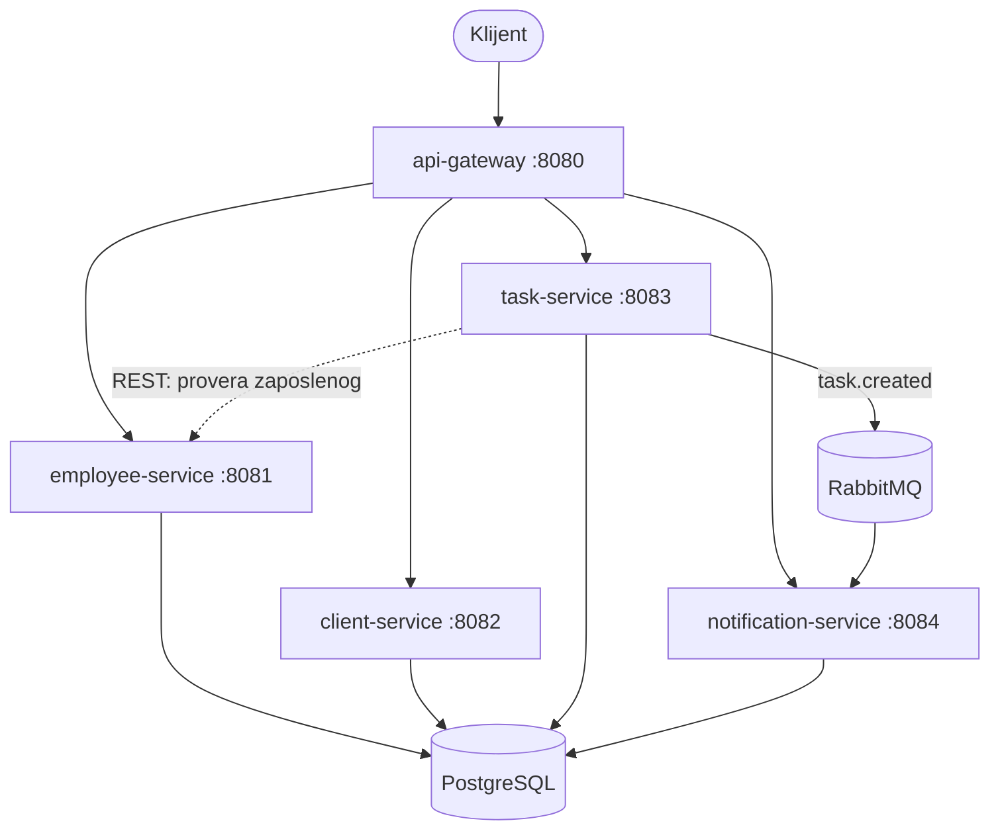

# CRM/HRM mikroservisni sistem

Sistem za upravljanje zaposlenima, klijentima, zadacima i notifikacijama, razvijen kao
mikroservisna arhitektura sa punim DevOps lancem: kontejnerizacija, CI/CD, statička
analiza, metrike, centralizovani logovi i distribuirano praćenje zahteva.

## Arhitektura



Gateway je jedina ulazna tačka za poslovne pozive. Svaki servis ima **svoju bazu podataka**
u zajedničkoj PostgreSQL instanci, čime se izbegava deljenje šeme između servisa.

## Servisi i portovi

| Komponenta | Port | Uloga |
|---|---|---|
| `api-gateway` | 8080 | Rutira `/api/**` ka odgovarajućem servisu |
| `employee-service` | 8081 | Zaposleni, pun CRUD |
| `client-service` | 8082 | Klijenti, uključujući reaktivne stream endpointe |
| `task-service` | 8083 | Zadaci, pun CRUD, producer `task.created` događaja |
| `notification-service` | 8084 | Konzumer događaja, evidencija notifikacija |
| PostgreSQL | 5432 | Četiri baze: `employee_db`, `client_db`, `task_db`, `notification_db` |
| RabbitMQ | 5672 / 15672 | Broker poruka i njegov web interfejs |
| Prometheus | 9090 | Prikupljanje metrika |
| Grafana | 3000 | Dashboard sa metrikama i pregled logova |
| Loki | 3100 | Centralizovani logovi |
| Zipkin | 9411 | Distribuirani trace-ovi |

## Endpointi

Svi poslovni pozivi idu kroz gateway, sa prefiksom `/api`.

| Metoda | Putanja | Opis |
|---|---|---|
| GET | `/api/employees` | Lista zaposlenih |
| GET | `/api/employees/{id}` | Jedan zaposleni, `404` ako ne postoji |
| POST | `/api/employees` | Kreiranje zaposlenog, vraća `201` |
| PUT | `/api/employees/{id}` | Izmena zaposlenog |
| DELETE | `/api/employees/{id}` | Brisanje zaposlenog, vraća `204` |
| GET | `/api/clients` | Lista klijenata |
| GET | `/api/clients/{id}` | Jedan klijent |
| POST | `/api/clients` | Kreiranje klijenta |
| GET | `/api/clients/stream` | Reaktivni stream (`Flux`, Server-Sent Events) |
| GET | `/api/clients/flowable` | Reaktivni stream (RxJava `Flowable`) |
| GET | `/api/tasks` | Lista zadataka |
| GET | `/api/tasks/{id}` | Jedan zadatak |
| POST | `/api/tasks` | Kreiranje zadatka, `404` ako zaposleni ne postoji |
| PUT | `/api/tasks/{id}` | Izmena zadatka |
| DELETE | `/api/tasks/{id}` | Brisanje zadatka |
| GET | `/api/notifications` | Notifikacije nastale iz `task.created` događaja |

Svaki servis dodatno izlaže `/actuator/health`, `/actuator/metrics` i `/actuator/prometheus`
na svom portu.

## Pokretanje

Potreban je samo Docker sa Compose dodatkom.

```bash
git clone https://github.com/LukaC011/devOps.git
cd devOps
cp .env.example .env
./deploy.sh
```

Na Windows-u, ako kloniranje prijavi `Filename too long`, uključi podršku za duge
putanje jednom: `git config --global core.longpaths true`. Java paket struktura je
dublja od podrazumevanog Windows ograničenja.

`deploy.sh` builda i podiže sve kontejnere, sačeka da svaki prijavi `healthy`, zatim proveri
`/actuator/health` na svih pet servisa i rutiranje kroz gateway. Skripta vraća neuspeh ako
bilo koja provera ne prođe.

Alternativno, bez skripte:

```bash
docker compose up -d --build --wait
```

Gašenje, uz brisanje podataka:

```bash
docker compose down -v
```

## Provera da sistem radi

```bash
curl -X POST http://localhost:8080/api/employees \
  -H 'Content-Type: application/json' \
  -d '{"firstName":"Mila","lastName":"Jovanovic","position":"HR Manager","email":"mila@crm.rs"}'

curl -X POST http://localhost:8080/api/tasks \
  -H 'Content-Type: application/json' \
  -d '{"title":"Pripremi ponudu","description":"Ponuda za klijenta","employeeId":1}'

curl http://localhost:8080/api/notifications
```

Poslednji poziv treba da vrati notifikaciju koja je nastala automatski, preko RabbitMQ-a,
kao posledica kreiranja zadatka.

## Alati

| Alat | Adresa | Pristup |
|---|---|---|
| Grafana | http://localhost:3000 | `admin` / `admin` (menja se u `.env`) |
| Prometheus | http://localhost:9090 | bez prijave |
| Zipkin | http://localhost:9411 | bez prijave |
| RabbitMQ | http://localhost:15672 | kredencijali iz `.env` |

Grafana se diže sa već povezanim Prometheus i Loki datasource-ima i dashboardom
**CRM System Overview**, koji sadrži panele `Latency (p95)`, `Throughput (req/s)` i
`Error rate`. Ništa se ne podešava ručno.

## Komunikacija između servisa

| Tip | Gde | Opis |
|---|---|---|
| REST, sinhrono | klijent do gateway-a do servisa | Rutiranje po `Path` predikatu uz `StripPrefix` |
| REST, servis ka servisu | `task-service` ka `employee-service` | Provera da li zaposleni postoji pre kreiranja zadatka |
| Message queue | `task-service` ka `notification-service` | `task.created` preko `TopicExchange`-a |
| Reaktivno | `client-service` | WebFlux `Flux` i RxJava `Flowable`, oba kao Server-Sent Events |

## Praćenje rada sistema

Jedan `POST /api/tasks` proizvodi jedan trace koji u Zipkin-u obuhvata gateway,
`task-service`, `employee-service` i `notification-service`, uključujući i skok kroz
RabbitMQ. Logovi svih servisa nose `traceId` i `spanId`, pa se u Grafani nad Loki
datasource-om mogu filtrirati svi logovi jednog zahteva, upitom oblika
`{application="task-service"} | traceId=<vrednost>`.

## Testiranje

| Nivo | Gde | Pokretanje |
|---|---|---|
| Jedinični i integracioni | `backend/*/src/test` | `mvn -f backend/pom.xml verify` |
| End-to-end | `e2e-tests` | `mvn -f e2e-tests/pom.xml verify` uz podignut sistem |

Jedinični testovi koriste ugrađenu H2 bazu, pa ne zahtevaju pokrenut PostgreSQL.
End-to-end testovi rade nad stvarno podignutim sistemom, kroz gateway.

## CI/CD

Pri svakom push-u i pull request-u pokreće se CI: build i testovi svih pet servisa kroz
aggregator POM, SonarCloud analiza sa JaCoCo izveštajem o pokrivenosti, upload build
artefakata, Docker build svih pet image-a i end-to-end testovi nad podignutim sistemom.
Statička analiza obara build ako SonarCloud quality gate nije zadovoljen.

Pri merge-u u `main` pokreće se CD: build i objava svih pet image-a na GitHub Container
Registry, tagovanih sa `latest` i sa SHA commit-a. Nakon objave, poseban job povlači upravo
objavljene image-e, podiže ceo sistem i pada ako bilo koji servis nije zdrav ili ako lanac
od kreiranja zadatka do notifikacije ne prođe.

## Struktura repozitorijuma

```
backend/                 aggregator POM i pet servisa
e2e-tests/               end-to-end testovi nad podignutim sistemom
grafana/                 provisioning datasource-a i dashboard
initdb/                  SQL skripta koja kreira bazu po servisu
.github/workflows/       CI i CD pipeline
docker-compose.yml       ceo sistem, sa healthcheck-ovima
deploy.sh                lokalni deploy sa post-deploy proverom
DOKUMENTACIJA.docx       projektna dokumentacija po tačkama specifikacije
```

## Tehnologije

Java 17, Spring Boot 4.0.5, Spring Cloud Gateway, Spring Data JPA, Spring AMQP,
Project Reactor i RxJava 3, PostgreSQL, RabbitMQ, Maven, Docker i Docker Compose,
GitHub Actions, SonarCloud sa JaCoCo, Prometheus, Grafana, Loki i Zipkin.
